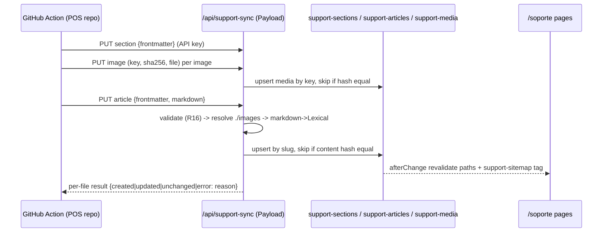

# Support Center - Plan

## Goal Capsule

- **Objective:** Add a public support center at `/soporte`, backed by its own Payload collections that are separate from the blog. Articles are written in the POS project and pushed here through Payload's API from GitHub Actions.
- **Product authority:** Decisions below were confirmed in the 2026-10-05 brainstorm. This work builds the structure (collections, API ingestion, public pages). Writing and migrating the article content happens in the POS repo and is not in scope here.
- **Open blockers:** None.
- **Product Contract preservation:** Product Contract unchanged. The planning-deferred Outstanding Questions are resolved in the Planning Contract (KTD1, KTD2, KTD5, KTD6).

## Product Contract

### Summary

A help center for Mesanube customers that also ranks in search for prospects. Flat sections hold task-oriented articles. Articles reach Payload through an authenticated API sync from the POS repo, and readers get search, a "¿Te sirvió?" vote and a contact fallback.

### Key Decisions

- **Dedicated collections, not a "type" flag on Posts.** Keeps the blog and support separate in the admin, in search and on the site. Governs R1, R2.
- **Flat sections (one level).** Enough for hundreds of articles and simple to maintain. Governs R2.
- **Content arrives via Payload's native API with an API key, not Basic Auth.** Payload already exposes REST; per-user API keys (`useAPIKey`) are built in but not enabled today (`src/collections/Users/index.ts:18` has only `auth: true`). Governs R5–R8.
- **Source format is Markdown with frontmatter, defined by `docs/support-article-guidelines.md`.** Existing POS articles get rewritten to match it. The sync enforces this contract: folder = section, filename = slug = identity, and a restricted Markdown subset. Governs R3, R4, R16.
- **Public and indexable.** Readers include prospects arriving from Google. Governs R11, R12.

### Requirements

**Content model**
- R1. Support articles live in their own collection, separate from Posts, editable in the Payload admin.
- R2. Each article belongs to exactly one section. Sections are one level deep and editors set their order manually.
- R3. An article has a task-oriented title (for example, "Cómo anular una factura"), a short summary, rich content with screenshots, a "last updated" date, SEO fields and draft/published status.
- R4. Articles have a stable slug that the sync uses as an identity key, so re-pushing the same article updates it instead of duplicating it.

**API ingestion (GitHub Actions from the POS repo)**
- R5. An external job can create and update sections, articles and their images through Payload's API, authenticated with an API key.
- R6. The API key belongs to a dedicated integration user who can only write support content. It cannot touch posts, pages, users or globals.
- R7. Re-running the sync with unchanged content is idempotent: no duplicate articles or images.
- R8. The API key is stored as a GitHub Actions secret and never in the repo.
- R16. Files that break the guidelines (missing required frontmatter, section mismatch, disallowed Markdown) fail the sync with a clear per-file error and are not published.

**Public site**
- R9. `/soporte` shows the sections with their articles and a search box. Each section has its own page, and each article has its own URL nested under its section.
- R10. Search finds published support articles by title and content, independently of blog search.
- R11. Article pages are indexable: they appear in the sitemap and have a canonical URL, Open Graph tags and breadcrumbs, following the existing detail-page SEO patterns.
- R12. Only published articles are publicly visible.
- R13. Each article ends with a "¿Te sirvió?" yes/no vote. The team can see per-article results in the admin.
- R14. Each article and the search results end with a "¿No encontraste lo que buscabas?" CTA that uses the contacts in `src/config/contact.ts`.
- R15. Pages follow the canonical tokens and copy rules (voseo, no emojis).

### Acceptance Examples

- AE1 (covers R4, R7). The Action pushes "Cómo anular una factura" twice with the same slug. The admin shows one article updated to the latest content.
- AE2 (covers R6). A request using the integration key to modify a blog post is rejected.
- AE3 (covers R12). A draft article returns 404 on the public site and is missing from the sitemap and search.
- AE4 (covers R13). A reader votes "No" once. The admin count for that article increases by one.

### Scope Boundaries

- Out of scope: subsections, related articles, contextual links from the POS app, customer-only or private content, and content filtered by plan. If a feature belongs to one plan, the article says so in its text.
- Out of scope: writing or migrating the articles, and the GitHub Action itself, which lives in the POS repo. This work only defines the API contract the Action uses.

### Outstanding Questions

All four were resolved during planning. See KTD1 (Markdown is converted on the server), KTD2 (image dedupe), KTD6 (vote abuse) and KTD5 (no auto-unpublish).

---

## Planning Contract

### Context and Patterns

- Collections follow `src/collections/Posts/index.ts`: drafts, `slugField`, SEO fields from `@payloadcms/plugin-seo/fields`, `authenticatedOrPublished` read access, and revalidation hooks (`src/collections/Posts/hooks/revalidatePost.ts`).
- Sitemaps follow `src/app/(frontend)/(sitemaps)/posts-sitemap.xml/route.ts` (`unstable_cache` + tag revalidation).
- Public pages follow the marketing rules: data + composition, canonical tokens, `shared/` building blocks (`CtaLink`, `FaqSection`, `SiteFooter`, `Reveal`), and the canonical/OG/breadcrumb helpers added in the SEO audit commits (`8a979b1`, `17d294f`).
- `Users` (`src/collections/Users/index.ts`) has no roles, and every collection's write access is `authenticated`. That is why R6 needs a role model.
- Payload and `@payloadcms/richtext-lexical` are on 3.71.1, which exports `convertMarkdownToLexical` and `editorConfigFactory`.
- Media is stored on R2 through `s3Storage` with `clientUploads` (`src/plugins/index.ts`). Vercel rejects request bodies over 4.5 MB.
- Tests: Vitest integration tests in `tests/int/` (`api.int.spec.ts`) and Playwright in `tests/e2e/`.

### Key Technical Decisions

- **KTD1. Server-side Markdown ingestion through a custom endpoint.** The Action posts `{ frontmatter, markdown }` per article (and per section) to `/api/support-sync/...`. The server validates against the guidelines (R16), converts to Lexical with the support editor config, and upserts by slug. *(session-settled: user-approved — chosen over converting in the Action: keeps the Action dumb and validation and editor config in one place.)* Governs R4, R5, R7, R16.
- **KTD2. Dedicated `support-media` upload collection.** Images are uploaded one per request, keyed by `<section>/<filename>` plus a content hash. Unchanged hash means skip; a changed hash replaces the file in place. Markdown `./images/x.png` references resolve to upload nodes by key. *(session-settled: user-approved — chosen over reusing `media`: scoped access for the integration user and no mixing with blog images.)* Governs R6, R7.
- **KTD3. Role field on Users (`admin`, `support-sync`) plus `useAPIKey`.** Non-support collections, `users` and globals require `admin` for writes. A missing role reads as `admin`, so existing accounts keep full access with no data migration. `support-sync` can write only the `support-*` collections and cannot log into the admin. *(session-settled: user-approved — chosen over Basic Auth on a custom route.)* Governs R5, R6, R8.
- **KTD4. Store the source Markdown and derived plain text on each article.** `sourceMarkdown` is hidden in the admin, and `plainText` feeds search (R10) and an idempotency hash (R7). An unchanged hash skips the write, so `updatedAt` and revalidation aren't touched.
- **KTD5. The POS repo is the source of truth, with no automatic pruning.** The sync never deletes or unpublishes. Editors unpublish removed articles by hand. The admin shows a notice that manual edits get overwritten on the next sync. *(session-settled: user-approved.)*
- **KTD6. Votes are counters on the article, incremented through a public endpoint.** One vote per article per browser (localStorage), with no server-side rate limit in v1. The endpoint only increments `helpfulYes`/`helpfulNo` and never accepts other fields.
- **KTD7. Support search queries `support-articles` directly** (title, summary, `plainText`) and does not join the blog `search` plugin collection. This keeps it independent (R10) and leaves `src/plugins/index.ts` search config untouched.
- **KTD8. URL shape is `/soporte`, `/soporte/<section>` and `/soporte/<section>/<slug>`.** Article slugs are unique globally, not per section, so the sync identity is one key (R4). A page whose section segment doesn't match the article's section redirects to the canonical URL.

### High-Level Technical Design



### Output Structure

```
src/collections/Support/
  SupportSections.ts  SupportArticles.ts  SupportMedia.ts
  hooks/revalidateSupport.ts
  editor.ts                      # support Lexical feature set
src/endpoints/supportSync/       # section, image, article handlers + validate.ts + markdown.ts
src/access/roles.ts              # isAdmin, isAdminOrSupportSync
src/app/(frontend)/soporte/
  page.tsx  [section]/page.tsx  [section]/[slug]/page.tsx
src/app/(frontend)/(sitemaps)/support-sitemap.xml/route.ts
src/components/support/          # SupportHero, SectionList, ArticleBody, HelpfulVote (client), SearchBox, ContactCta
```

---

## Implementation Units

### U1. Roles and API key on Users

**Goal:** Introduce the `admin` and `support-sync` roles and enable API keys.
**Requirements:** R5, R6, R8. KTD3.
**Dependencies:** None.
**Files:** `src/collections/Users/index.ts`, `src/access/roles.ts`, `src/collections/Pages/index.ts`, `src/collections/Posts/index.ts`, `src/collections/Media.ts`, `src/collections/Categories.ts`, `src/Header/config.ts`, `src/Footer/config.ts`, `src/payload-types.ts` (generated), `tests/int/access.int.spec.ts`
**Approach:**
1. Add a `role` select field. The default is `admin`, and access helpers treat a missing value as `admin`.
2. Enable `useAPIKey`. Block admin-panel access for `support-sync`.
3. Swap `authenticated` for `isAdmin` on writes in the non-support collections, `users` and the globals. Read access stays unchanged.
4. Run `yarn generate:types`.

**Test scenarios:**
- A user with no role can still create a post.
- A `support-sync` user authenticated by API key gets 403 on post update. Covers AE2.
- A `support-sync` user cannot create or update users, which blocks self-escalation.
- A `support-sync` user cannot log into `/admin`.

**Verification:** Existing editors work unchanged in the admin, and the integration key is rejected outside support content.

### U2. Support collections

**Goal:** Add the `support-sections`, `support-articles` and `support-media` collections.
**Requirements:** R1, R2, R3, R4, R12, R13. KTD2, KTD4, KTD5.
**Dependencies:** U1.
**Files:** `src/collections/Support/*`, `src/payload.config.ts`, `src/plugins/index.ts` (add `support-media` to `s3Storage`), `tests/int/support-collections.int.spec.ts`
**Approach:**
- **Sections:** title, slug (unique), description and order.
- **Articles:** title, slug (unique), section relationship (required), summary, `order`, `updated` date, `content` (Lexical with the support feature set: h2/h3, lists, link, blockquote, upload to `support-media`), SEO fields, drafts, read-only `helpfulYes`/`helpfulNo`, and hidden `sourceMarkdown`, `plainText` and `contentHash`. Show a description notice about sync overwrites.
- **Media:** an upload collection with `key` (unique), `sha256` and `alt`.
- **Access:** reads use `authenticatedOrPublished` (media: `anyone`), and writes use `isAdminOrSupportSync`.
- **Revalidation hooks:** cover the article path, its section page, `/soporte` and the `support-sitemap` tag, mirroring `revalidatePost`.

**Patterns to follow:** `src/collections/Posts/index.ts`, `src/collections/Posts/hooks/revalidatePost.ts`.
**Test scenarios:**
- Creating two articles with the same slug fails.
- An article without a section fails validation.
- An anonymous read of a draft article returns nothing. Covers AE3.
- Publishing an article triggers revalidation of the article, section and index paths.

**Verification:** Collections appear in the admin under a "Soporte" group, and types regenerate cleanly.

### U3. Sync endpoints (sections, images, articles)

**Goal:** Implement the ingestion contract the GitHub Action calls.
**Requirements:** R4, R5, R7, R16. KTD1, KTD2, KTD4.
**Dependencies:** U1, U2.
**Files:** `src/endpoints/supportSync/{index,section,image,article,validate,markdown}.ts`, `src/payload.config.ts`, `tests/int/support-sync.int.spec.ts`, `docs/support-sync-api.md`
**Approach:**
1. Authenticate with `req.user` and require `support-sync` or `admin`. Pass `req` to every nested operation.
2. Validate the frontmatter schema and slug/section rules from `docs/support-article-guidelines.md`. Reject raw HTML, tables, `#` H1 and unknown image references, returning the line number.
3. Convert Markdown with `convertMarkdownToLexical` using the support editor config. Map `./images/x.png` to upload nodes by `<section>/x.png`.
4. Hash the source and upsert by slug. Set `_status` from frontmatter `status`.
5. Respond with a per-file result (`created`, `updated`, `unchanged` or `error` plus a reason).
6. Document the request shapes in `docs/support-sync-api.md` for the POS-side Action.

**Execution note:** Start with failing integration tests against the documented request/response contract.
**Test scenarios:**
- Posting the same article twice yields `created`, then `unchanged`, and one document exists. Covers AE1.
- Changing the body then re-posting yields `updated` with the new content.
- Missing `summary` returns an error naming the field, and nothing is written.
- `section: facturacion-arca` when no such section exists returns an error.
- Markdown containing `<div>` or a table returns an error with the line number.
- An image reference with no uploaded `support-media` key returns an error.
- Uploading an image twice with the same hash creates one doc. A changed hash replaces the file and keeps the same id.
- An anonymous request returns 401. A request with a post-editing-only key gets the same result as U1.
- `status: draft` stores an unpublished article.

**Verification:** A local script replaying the sample article from the guidelines produces a correctly rendered article with its image.

### U4. Public support pages

**Goal:** Build `/soporte`, the section pages and the article pages with SEO.
**Requirements:** R9, R11, R12, R14, R15. KTD8.
**Dependencies:** U2.
**Files:** `src/app/(frontend)/soporte/page.tsx`, `src/app/(frontend)/soporte/[section]/page.tsx`, `src/app/(frontend)/soporte/[section]/[slug]/page.tsx`, `src/components/support/*`, `src/app/(frontend)/(sitemaps)/support-sitemap.xml/route.ts`, `next-sitemap.config.cjs` (register sitemap), `tests/e2e/support.e2e.spec.ts`
**Approach:**
1. Use Server Components with `generateStaticParams` plus on-demand revalidation.
2. Render article content with the existing Lexical `RichText` renderer plus an upload-node converter using `next/image`.
3. Add breadcrumb JSON-LD, canonical and OG tags with the existing helpers.
4. Show the "Actualizado el …" date.
5. Put a contact CTA from `src/config/contact.ts` at the end of each article.
6. Redirect a mismatched section segment to the canonical URL.
7. Add a footer link to `/soporte`.

**Patterns to follow:** the `/funciones/*` detail pages for SEO metadata, `shared/CtaLink`, tokens from `.claude/rules/frontend.md`.
**Test scenarios:**
- `/soporte` lists published sections in `order`, with their articles.
- An article page renders its title, content, image, updated date, breadcrumbs and contact CTA.
- A draft article URL returns 404. Covers AE3.
- `/soporte/otra-seccion/anular-una-factura` redirects to the canonical section URL.
- `support-sitemap.xml` lists only published articles.

**Verification:** Pages render at 375px and 1280px with no raw hex colors, and the copy uses voseo.

### U5. Search

**Goal:** Add support-only search on `/soporte`.
**Requirements:** R10, R14. KTD7.
**Dependencies:** U2, U4.
**Files:** `src/app/(frontend)/soporte/buscar/page.tsx`, `src/components/support/SearchBox.tsx`, `tests/int/support-search.int.spec.ts`
**Approach:** Use a GET form to `/soporte/buscar?q=`, so it works without JavaScript. The server queries published articles with `title`, `summary` and `plainText` `like` conditions, sorts title matches first, and shows the contact CTA on empty or any results. Mark the results page `noindex`.
**Test scenarios:**
- A query matching only body text finds the article.
- A blog post with the same word does not appear.
- Draft articles never appear. Covers AE3.
- An empty query shows the "no encontraste" CTA with no error.

**Verification:** Searching "nota de crédito" finds the sample article.

### U6. "¿Te sirvió?" vote

**Goal:** Collect yes/no feedback per article.
**Requirements:** R13. KTD6.
**Dependencies:** U2, U4.
**Files:** `src/endpoints/supportVote.ts`, `src/components/support/HelpfulVote.tsx` (client), `tests/int/support-vote.int.spec.ts`
**Approach:**
1. Add a public `POST /api/support-articles/:id/vote` with body `{ value: 'yes' | 'no' }`. It does an atomic increment with `overrideAccess` limited to the counter field, on published articles only, and skips revalidation (`context.disableRevalidate`).
2. The client component remembers the vote in localStorage (wrapped in try/catch) and shows a thank-you state.
3. Add columns in the admin list view.

**Test scenarios:**
- A "no" vote increments `helpfulNo` by one. Covers AE4.
- An invalid value returns 400.
- A vote on a draft or unknown id returns 404.
- A body containing other fields (for example `title`) changes nothing else.

**Verification:** Votes show in the admin list columns without changing the article's `updatedAt`.

---

## Verification Contract

- `tsc --noEmit`, `yarn lint` and `yarn test:int` pass. `yarn test:e2e` passes for `tests/e2e/support.e2e.spec.ts`.
- `yarn generate:types` and `yarn generate:importmap` are run, and the generated files are committed.
- A manual smoke test: create a `support-sync` user, generate a key, replay the guidelines example through the sync endpoints with curl, and see it at `/soporte/facturacion-arca/anular-una-factura`.

## Definition of Done

- U1–U6 are implemented, and every listed test scenario exists and passes.
- `docs/support-sync-api.md` documents the endpoint contract for the POS-side Action.
- Existing admin users keep full access, and the integration key cannot write outside support content.

## Risks

- **`convertMarkdownToLexical` may not map Markdown images to upload nodes.** Mitigation: pre-process image references into a custom transformer or a post-conversion node replacement in `markdown.ts`. Verify this first in U3.
- **Tightening write access could lock out an existing editor whose stored role is unexpected.** Mitigation: missing role equals `admin`, and U1 tests cover it.
- **The public vote endpoint can be inflated by scripts.** This is accepted for v1 (KTD6). Revisit if the numbers look abnormal.

### Deferred to Follow-Up Work

- The GitHub Action itself, in the POS repo, built against `docs/support-sync-api.md`.
- Auto-unpublishing articles removed from the repo.
